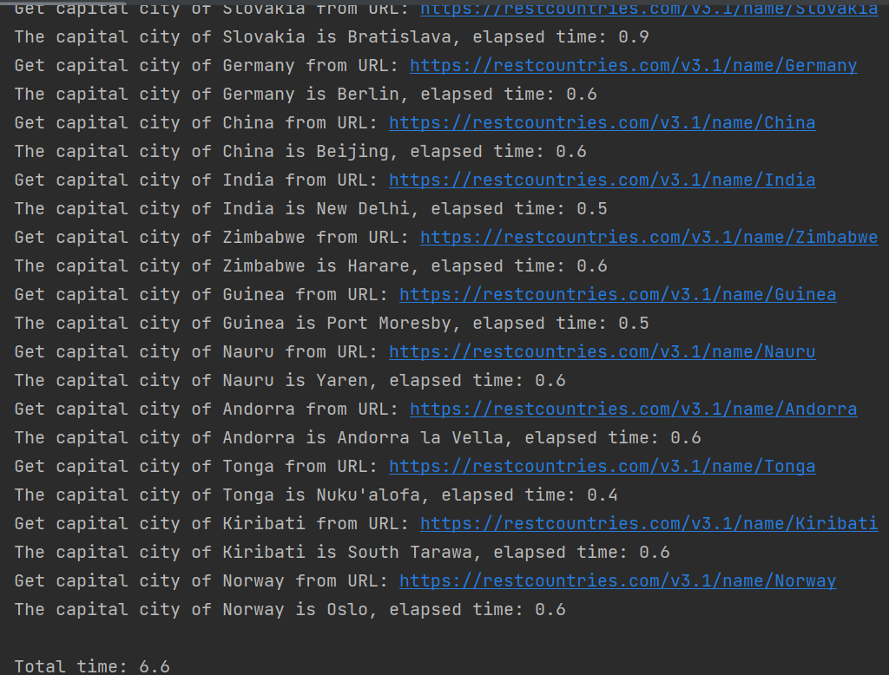

# ppds2022

Full subject name:  
**Slovak:** Paralelné programovanie a distribuované systémy  
**English:** Parallel programming and distributed systems

***
Links for [lecture](https://www.youtube.com/watch?v=qSHlfSIzguQ)
and [exercise](https://www.youtube.com/watch?v=ZoUPTSNcNWM)  on YouTube
and [exercises](https://uim.fei.stuba.sk/i-ppds/8-cvicenie-asynchronne-programovanie/) in text form for these programs.
***

Exercise 8
-----------
*******
**Assignment**  
Write your own single-threaded application in two versions: synchronous and asynchronous (using native coroutines). In
the enclosed documentation, explain the purpose of the application and make a performance comparison of the synchronous
and asynchronous versions. Do not forget to justify the results obtained (acceleration, deceleration, unchanged
performance).

*Solution*:
Create the synchronous and asynchronous programs to find the capital city of a country. Program looks for a data for
country from the list:
['Slovakia', 'Germany', 'China', 'India', 'Zimbabwe', 'Guinea', 'Nauru', 'Andorra', 'Tonga', 'Kiribati', 'Norway'].
We use this [API]('https://restcountries.com/v3.1/name/') for the programs. To find out and show the difference are
implemented counter timers. One for total time and one to measure elapsed time to get the capital from the API.

*Variation1- SYNCHRONOUS VERSION*:
In the `main()` function starts timer at the beginning. Then is called `get_capital_city()` function for all country
with that country as parameter. When all called functions are finished, timer is stopped and prints this total time on
the screen.

Function `get_capital_city(country)` prints country, for which finds the capital city. Before HTTP request start timer.
From response is selected the capital and program prints the capital city for the country with elapsed time.

From the following screenshot we can see that the acquisition of the capital usually took 0.6s. Because this is a
synchronous version, the program waited for a response and only after the end of the function for one country continued
the other. If we calculate the total times of waiting and processing for the response it took 6.5s, so 0.1s elapsed
outside the waiting for the response.  

