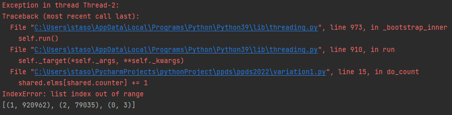
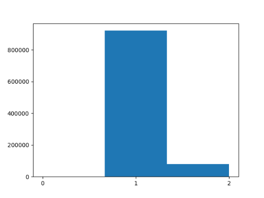

# ppds2022

Full subject name:  
**Slovak:** Paralelné programovanie a distribuované systémy  
**English:** Parallel programming and distributed systems

Exercise 1
-----------
*******
**Assignment**  
Implement two threads, which will use a common index to a common array of the size (initialized to zero). Let each
thread increment the element of the array where the common index is pointing and then increment the index. If the index
is out of range, the thread terminates. After this action count, how many elements of the array have value 1. If not
every element has value 1, modify program. After threads termination find out the multiplicity of values in array
(histogram).

**Problem**  
If we decide to implement an array in the range of 1_000_000, the same number of elements from this array should have a
value of 1. According to following screenshot there are the unexpected elements with value of 2 or 0. Also, some
original code executions cause indexError.

This problem arises due to competitive programming. When one thread increases the value on the index and after that does
not increase the index, subsequently program switch to another thread, which also increases the same value. This is
example when one thread does not finish executing the required work.

For better graphical visualization of the array elements is histogram inserted into this file.

**Solution**  
It is advisable to use 'mutual exclusion' for correct program behavior. It is possible to lock a critical area. One
thread lock and execute the critical area and other thread(s) waits for unlock. The mutex must be inserted into the
program to prevent multiple threads increasing the element value in the array on the same index.

*Variation_1*:
Lock whole function `do_count`. The entire while loop is executed under lock. Therefore, it does not happen that the
second thread successfully entered to loop just before the first thread invalidates the condition. It also does not
happen that two threads increase the array value on the same index almost at the same time. Unfortunately, whole logical
part of the program is executed by only one thread and the other does not have time to modify the array, and therefore a
large part of the program is executed serially. Only one thread increases elements in array.

*Variation_2*:
Because a large part of the code is executed serially in variation_1, it would be appropriate to modify the locking
logic. A good solution is when threads will be able to change in the loop. Mutex locks on the beginning of the loop and
unlock after increasing the element or at the end of array. For control the condition under lock, it must be inserted
into the body of the loop. In this variation is more competitive programming. In this variation more threads (in this
case 2) increasing the array elements.   