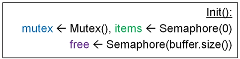
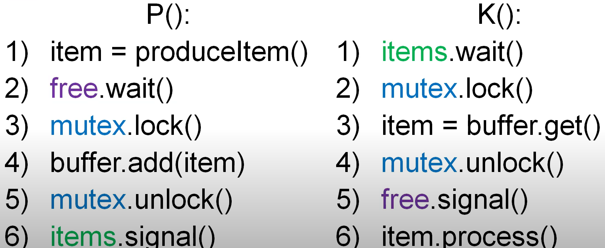
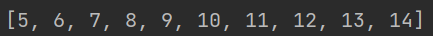
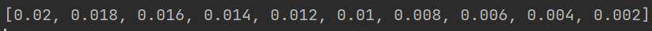
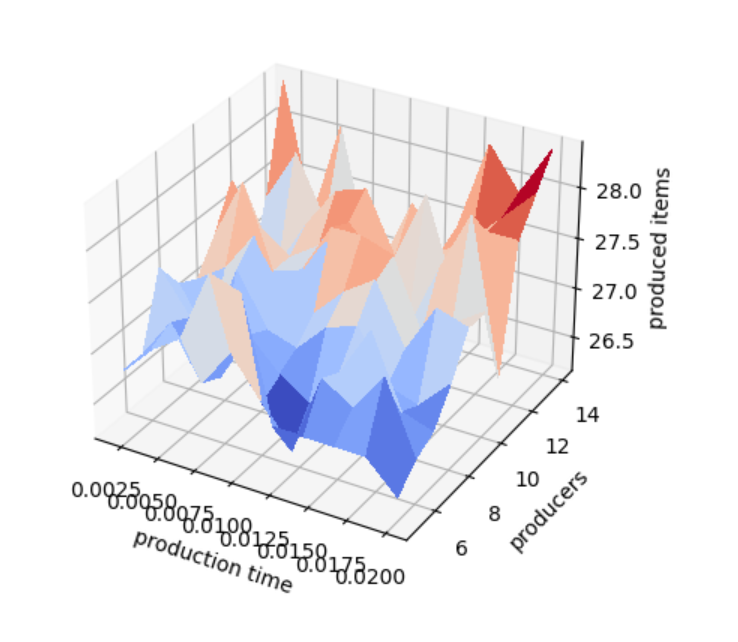

# ppds2022

Full subject name:  
**Slovak:** Paralelné programovanie a distribuované systémy  
**English:** Parallel programming and distributed systems

***
Links for [lecture](https://www.youtube.com/watch?v=WcaVHQM8zVo&t=5233s)
, [exercise](https://www.youtube.com/watch?v=ELjAmi69cEI) on YouTube
and [exercises](https://uim.fei.stuba.sk/i-ppds/3-cvicenie-fibonacci-vypinac-p-k-c-z-%f0%9f%92%a1/?%2F) in text form for
these programs.
***

Exercise 3
-----------
*******
**Assignment**  
Implement the Consumer-Producer solution.

Screens from the [lecture](https://www.youtube.com/watch?v=WcaVHQM8zVo&t=5233s).  

Experiment with some system settings:

- product production time,
- product processing time,
- count of consumers,
- count of producers,
- storage size.

*Solution*:
The program simulates a warehouse where producers produce items and store them in a warehouse, and consumers unload
items from the warehouse and then process them. The warehouse has a maximum capacity of 5. We define 2 threads as
consumers and threads for producers change according to the experiment. Because we should try 100 different settings of
the modeled system, so we combine 10 different count of producers:
  
Each count of producers produce items in 10 different times:

Each combination of these two settings is repeated ten times and their average is saved. We examine their dependence on
how many products producers are able to store in a single run if the warehouse has a capacity of 5 items.

We can see the dependence on the graph:

As we can see, as the producers increased, the number of stored items also increased. Interestingly, when production
time was the highest, the most products were produced. Apparently it did not have to wait for a product to be produced,
because there was still some waiting to be stored. The best solution with such a warehouse capacity is to have as many
producers as possible, even if the production time is higher. Also, a high number of produced items is a high number of
producers with a low production time. This is probably because even though the warehouse was empty, it didn't take long
to create new items, so the producers were able to quickly create the items and fill the warehouse with them. The worst
combination was with the average production time and the lowest number of producers.
