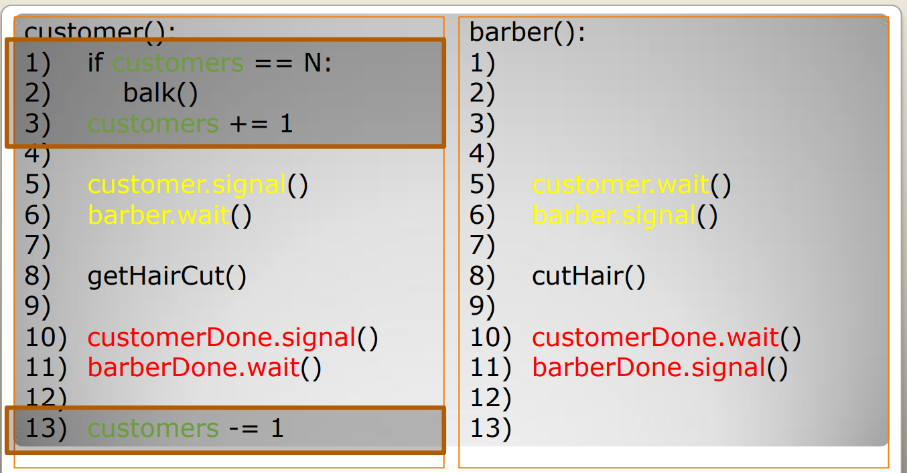

# ppds2022

Full subject name:  
**Slovak:** Paralelné programovanie a distribuované systémy  
**English:** Parallel programming and distributed systems

***
Links for [lecture](https://www.youtube.com/watch?v=Vvzh2N31EyQ) on YouTube
and [exercises](https://uim.fei.stuba.sk/i-ppds/6-cvicenie-menej-klasicke-synchronizacne-problemy/) in text form for
these programs.
***

Exercise 6
-----------
*******
**Assignment 1- Barber problem**  
Implement one of problem from the lecture. We decided to implement the barber problem. When one barber cuts hair of his
customers. They come to the barber and wait in the waiting room to be called. The waiting room has the maximum number of
possible waiting customers. So when waiting room is full, they will come later. Between cutting they live own life and
when hair grows up, they visit the barber again.

*Solution*:  
At the beginning we create one Thread simulates barber and the value of CUSTOMERS_COUNT customers Threads. Because this
threads will work with same objects, so there is needed the `Shared` class. All threads can access the properties of
this class.

CUSTOMER activity:
Customer activity simulates `customer()` function. They live own life and let their hair grow. Later some customer comes
to the barber. There we must check, if the waiting room in barber is not full. So there is necessary add
counter `customers_count` to the shared class. Because we use some counter and condition for this counter, we implement
a synchronization tool `Mutex()`. Every customer, who comes to barber has his own information tool, which barber invites
him to sit in a chair. For this we use own `barber_semaphore = Semaphore()` for all customers threads. These semaphores
will gradually be placed in the `queue` in which the customers came and the barber will continually call them into the
chair. Checking if the room is full, increasing the number of customers and adding to `queue` is under a mutex to
maintain data integrity. After this part we can unlock the area for other customers (threads). It signals to the barber
with a `customer = Semaphore()` that the customer is ready to cutting. Subsequently, the customer waits for the barber's
signal that he can sit on a chair. For this customer uses own `barber_semaphore`. Now, the code is executed
competitively with the barber code of cutting. The customer lets the barber know that he is satisfied with the hairstyle
with another `customer_done = Semaphore()` and waits for the barber to finish his hairstyle and allows him to leave the
chair with the help of another `barber_done = Semaphore()`. Finally, the customer decrease the counter `customers_count`
and leaves. This happens in a cycle.

BARBER activity:
Barber waits until the customer uses `Semaphore customer` to signal that he is ready to cut. When the barber will select
from the `queue` some customer for cutting, it must be protected with a `Mutex`. To maintain integrity with the work of
the `queue`. The first customer in the `queue` is informed by the barber that he can sit into the chair. Barber waits
until the customer is satisfied at `Semaphore customer_done`. Barber completes the job and notifies the customer of the
end via `barber_done`.

In Shared class are implemented counter, queue and needed synchronizations tools:
customers_count = customers in the waiting room. queue = customers waiting for the barber in order as they arrived to
the waiting room. customer_done = the customer signals to barber that he is satisfied and barber can end his work.
barber_done = the barber agrees that he has completed his work. customer = customer signal to barber, that he is in
waiting room. mutex - synchronization tool to make the critical area atomically executed
      

*Output*:  
For better activity display and control we added help statements.   

