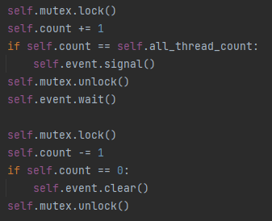

# ppds2022

Full subject name:  
**Slovak:** Paralelné programovanie a distribuované systémy  
**English:** Parallel programming and distributed systems

----

Links for [lecture](https://www.youtube.com/watch?v=sR5RWW1uj5g)
, [exercise](https://www.youtube.com/watch?v=vIiHVcb3HqU) on YouTube
and [exercises](https://uim.fei.stuba.sk/i-ppds/2-cvicenie-turniket-bariera-%f0%9f%9a%a7/?%2F) in text form for these
programs.
---

Exercise 2
-----------
*******
**Assignment 1**  
Implement ADT SimpleBarrier according to specifications from the lecture. First try to use ADT Semaphore for
synchronization as it was explained in the lecture. After successful implementation in this way, try to use event
signaling to implement the turnstile.  
Program creates 5 threads that execute the function. This function prints sentences (using function 'print' from
module 'ppds', which using lock for a comprehensive print) with meaning "Before barrier" and "After barrier" between
implemented barrier.

**Solution**:
Five threads print sentence before barrier with theirs id. They wait for all threads to complete this part of the code
thanks to the implemented barrier. When each thread come to the barrier, barrier releases all of them and threads print
sentence after barrier with theirs id. This functionality is implemented in the function `use_barrier`.

- body of `use_barrier`  
  
- output  
  

For expected output there will be used two different type of barriers. The first uses a turnstile, the second event.

*Variation_1*:
Declare a `TurnstileSimpleBarrier` class with thread count, counter, mutex, and turnstile. Turnstile is instance of
Semaphore. If `0` will be sent to Semaphore as a parameter, no thread will pass through the `wait()` method of turnstile
until the `signal()` method is called. Its parameter determines how many threads can pass through the turnstile `wait()`
method. Barrier synchronization is implemented in the `wait()` method of the `TurnstileSimpleBarrier` class. In the
method, it is necessary to counts how many threads evoked this method. We know from the first exercise that the counter
needs to be synchronized. There is a mutex for synchronization. During implementation is necessary to think, how to use
synchronization tools to avoid deadlock. The condition is also checked under lock if the counter has detected all the
threads. If not, the thread releases mutex lock and the turnstile blocks thread to wait for all the threads. However, if
the counter has detected all the threads, the turnstile invokes a `signal()` which also defines how many threads the
barrier will release - whereas all, so the number of created threads.

- turnstile barrier implementation  
  

*Variation_2*:
The implementation using an instance of the `Event()` class is not very different in the implementation from
Variation_1. Event method `wait()` still blocks threads. The difference is that the event `signal()` method does not
define how many threads the `wait()` method can release, but `wait()` will no longer block threads until the `clear()`
method is called. It is enough to use the barrier once to implement assignment 1, therefore the `clear()` method was not
used.

- event barrier implementation   
  

**Assignment 2**  
Use the same principle as in assignment 1, but the print is executed in a loop.

**Solution**:
For implementation is needed reusable barrier. Therefore, the barriers from assignment 1 will be reprogrammed. All
threads executing function. Each of thread print the sentence before barrier with id. Barrier waits for all threads.
Each of thread prints the sentence after barrier with id. Barrier again waits for all threads. This is executed in the
cycle.

- body of `use_barrier`   
  
- output   
  

Each of thread has to executed `rendezvous()`, subsequently `ko()` and it is executed in the loop.  
For expected output there are two variations implemented in the file "assignment_2":

- used two instances of the class `TurnstileBarrier`- using turnstile
- used two instances of the class `EventBarrier`- using event

*Variation_1*:
In the method `first_variation()` are initialized two instances of the class `TurnstileBarrier` and created the value
of `thread_count` (5) threads. Threads call `use_two_barriers`, which differs from `use_barrier` (from previous screen),
because in this variation is needed 2 different barriers (two turnstiles).

- body of `use_two_barrier`  
  

The `TurnstileSimpleBarrier` class is reprogrammed to be reusable. So when the last thread calls the `wait()` method
of `TurnstileBarrier` instance and the counter has the same value as is the number of threads, counter is restarted.
Afterwards is invoked the `signal()` method of turnstile. It identifies how many threads can release `wait()` method of
turnstile. If in `use_two_barriers()` was not used second instance, it would not be a correctly implemented parallelism.
For example, if one thread overtakes the thread which triggered the signal (so one thread is possible to execute part of
code twice and other none). If two instances are used, the next barrier does not invoke a signal until the last thread
calls wait on that barrier (and the second counter has the same value as the number of threads).

- turnstile barrier implementation  
  

*Variation_2*:
In this variation is also used the `use_two_barriers` method with instances of the `EventBarrier` class. It is for the
same reason as with `TurnstileBarrier`. Difference is in the implementation of the wait method of  `EventBarrier`. The
thread which invokes this method in the serial part (under lock) increases the counter by 1 and if the value of the
counter is not equal to the number of threads, it waits on `wait()` event method. The last threads invokes signal and
the `wait()` method is inactive until `clear()` is invoked.  
To prevent the last thread from being blocked, we create the opposite counter after the `wait()` event method. When the
counter is set to 0, the clear method is called. If we used only one instance of this class, the next time the barrier
was used, the thread that came out of the `wait()` of EventBarrier method and overtook the others would increment the
counter, when `clear()` method is not called, and parallelism would not be maintained. With two barriers, the last
thread will be waited for, so parallelism will be preserved.

- event barrier implementation  
  

**Assignment 3**  
Create N threads. Let `i` represent a node in which the element at position `i + 2` of the Fibonacci sequence (0, 1, 1,
2, 3, 5, 8, 13, 21…) is calculated. All threads share a common array in which the calculated sequence elements are
stored sequentially- during the calculation. First two elements are 0 and 1 initialized at the beginning. Use the
synchronization tools. Make synchronization to thread `i + 2` can calculate his Fibonacci number when previous sequence
numbers are calculated (after the `i` and `i + 1` threads).

**Solution**:
Implementation is possible in various ways. The most important thing is that the Fibonacci should be counted
sequentially and the threads should follow each other. If we tried to use as few synchronization objects as possible, we
managed to come up with a solution using one Mutex. (But the classmate shows me the solution without synchronization
objects. When thread controls in the loop, if at index `i + 1` (one before that thread should calculate) is not null, it
can calculate `i + 2`. In the loop the threads can switch. So no synchronization objects are needed.).  
We should also try to implement to the program, when turnstiles or events are used without. When we can switch them
without interfering with the application logic of the program. For this implemented variation of solution are needed two
barriers.

- filling fibonacci sequence  
  

- output   
  

There are three variations implemented in the file "assignment_3":

- used instance of Mutex
- used two barriers (instances of the class `TurnstileBarrier`- using turnstile)
- used two barriers (instances of the class `EventBarrier`- using event)

*Variation_1*:
Compute fibonacci using mutex as synchronization object. In the loop is looking for the right thread, which can continue
to fill the array for the Fibonacci sequence. All is executing under lock, and unlock is used after filled value to
array or when the thread is not right at the moment for filling, and it is better to release the lock to another thread.
To find the correct thread to calculate the value on a specific index of Fibonacci array, an instance of
the `FibonacciIndex` class is used, which is shared for all threads.

- body of `compute_fibonacci_without_barrier`  
  

*Variation_2*:
Very similar idea as variation_1. But if there should be used reusable barriers with turnstile, the `TurnstileBarrier`
class from "Assignment 2" was reprogrammed to this program. So all threads are blocked at the beginning of the
method `compute_fibonacci` to start executing "together". In the loop is detecting if the thread under lock is that,
which are looked for to calculate the fibonacci sequence. If it is true, thread break his loop, calculate and decrease
the number of threads, which the barrier has to wait (and there are used two barriers, so in both barriers it is
decreases). At the end is the lock released. If the thread has incorrect id- when is not necessary, the lock is released
and the second barrier is used.     
In the `TurnstileBarrier` class have been added methods - to return the count of threads, that not executed fibonacci
and the method to decreases count of threads, when some thread executed fibonacci counting and is no longer needed for
counting. In second method is necessary to check, if this thread should not invoke signal.

- body of `compute_fibonacci`  
  

*Variation_3*:
Almost everything is the same as in variation_2. But when we use the Event, the signal method deactivates blocking the
threads and blocking method needs to be reactivates. For simplicity, the `wait()`  method of the `EventBarrier` class
was also modified to a signal can be called without worry.

- event barrier implementation  
  
