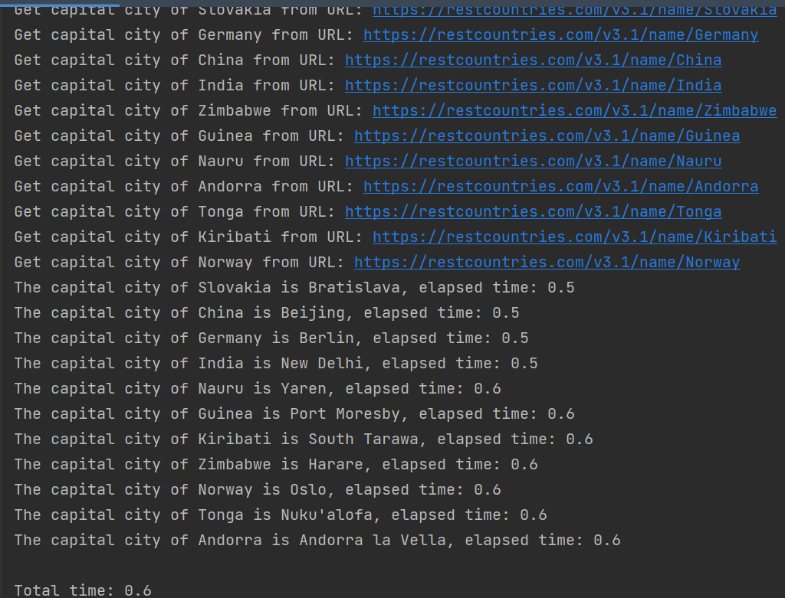

# ppds2022

Full subject name:  
**Slovak:** Paralelné programovanie a distribuované systémy  
**English:** Parallel programming and distributed systems

***
Links for [lecture](https://www.youtube.com/watch?v=qSHlfSIzguQ)
and [exercise](https://www.youtube.com/watch?v=ZoUPTSNcNWM)  on YouTube
and [exercises](https://uim.fei.stuba.sk/i-ppds/8-cvicenie-asynchronne-programovanie/) in text form for these programs.
***

Exercise 8
-----------
*******
**Assignment**    
Write your own single-threaded application in two versions: synchronous and asynchronous (using native coroutines). In
the enclosed documentation, explain the purpose of the application and make a performance comparison of the synchronous
and asynchronous versions. Do not forget to justify the results obtained (acceleration, deceleration, unchanged
performance).

*Solution*:  
Create the synchronous and asynchronous programs to find the capital city of a country. Program looks for a data for
country from the list:
['Slovakia', 'Germany', 'China', 'India', 'Zimbabwe', 'Guinea', 'Nauru', 'Andorra', 'Tonga', 'Kiribati', 'Norway'].
We use this [API]('https://restcountries.com/v3.1/name/') for the programs. To find out and show the difference are
implemented counter timers. One for total time and one to measure elapsed time to get the capital from the API.

*Variation1- SYNCHRONOUS VERSION*:  
In the `main()` function starts timer at the beginning. Then is called `get_capital_city()` function for all country
with that country as parameter. When all called functions are finished, timer is stopped and prints this total time on
the screen.

Function `get_capital_city(country)` prints country, for which finds the capital city. Before HTTP request start timer.
From response is selected the capital and program prints the capital city for the country with elapsed time.

From the following screenshot we can see that the acquisition of the capital usually took 0.6s. Because this is a
synchronous version, the program waited for a response and only after the end of the function for one country continued
the other. This behavior is also nice to see in the output. If we calculate the total times of waiting and processing
for the response it took 6.5s, so 0.1s elapsed
outside the waiting for the response.  

*Variation2- ASYNCHRONOUS VERSION*:  
In the program we use the module `asyncio`, which implements the event loop and methods for working with coroutines. We
also use Python `async` and `await` keywords, which indicate an asynchronous code.
With `asyncio.run(main())` program creates an event loop. This loop will run main()

The coroutine `main()` also start timer at the beginning. The coroutine objects are created and run with the
asyncio.gather () function. The "*" character expands objects. This feature schedules them and then runs them
competitively. At the end is printed total time.

The `get_capital_city()` native coroutine. The async with command allows to interrupt the execution of a coroutine on
entering and exiting a with block. It uses async frameworks for creating HTTP requests asynchronously, so it performs a
context switch back to the event loop. Code creates an aiohttp session context manager, then uses the session to get the
text retrieved from the URL asynchronously. Coroutine select the capital city of country and find out the elapsed time.

As we can see next output varies from previous. While waiting for a reply, they get to switch all the coroutines.
Therefore, they are first concluded by the data for which countries are searching for the capital and when response is
gradually coming and also prints the capital. We can note that the total time is as long as the longest time for
returning country data. This is because until one response was waiting a request for some next country was sent. So it
was waiting for all responses and the other parts of code did not take longer time in order to manifest on the total
time. So asynchronous version takes 6s less than synchronous.  

