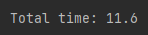

# ppds2022

Full subject name:  
**Slovak:** Paralelné programovanie a distribuované systémy  
**English:** Parallel programming and distributed systems

***
Links for [lecture](https://www.youtube.com/watch?v=qSHlfSIzguQ)
and [exercise](https://www.youtube.com/watch?v=ZoUPTSNcNWM)  on YouTube
and [exercises](https://uim.fei.stuba.sk/i-ppds/8-cvicenie-asynchronne-programovanie/) in text form for these programs.
***

Exercise 9
-----------
*******
**Assignment**    
Create a programming example on the GPU.

*Solution*:  
Since our system does not contain a graphics card with CUDA support, we use its simulation in this program. Initially,
you need to set the `NYMBA_ENABLE_CUDASIM` environment variable to 1 and import `cuda` from the `numba` framework.
To simulate the calculation on the GPU, we will use the calculation of the average image of two images. The image
represents a 3D field, where the size of the first two coordinates is the size of the image and the 3rd coordinate
defines the color of the pixel in RGB format. The exercise will be to resize the images to the same size
(122) and calculate pixel by pixel and calculate the average of each pair of pixels.

Because the program performs the calculations on the image, the arrangement of threads and blocks was chosen in matrix.
As shown in the screen, the threads are arrayed into blocks and blocks into a grid. In our proposed program, one thread
will be in charge of one pixel on which it will perform the calculation.  
  
[resource](https://docs.nvidia.com/cuda/cuda-c-programming-guide/index.html)

*Exercise*:  
The number of threads that can run parallel is 32 for previous versions of CUDA. Therefore, we determine the number
of threads in the block by a divisible value of 32. We have a defined threads size (16,16) in the program, so there will
be 256 in one block. All threads perform the same code. This makes the calculation more efficient. However, because it
can schedule only 32 threads at a time, there is a concurrent to switch threads.

We calculate the number of required blocks by dividing the image size by the number of threads. However, we may not
always fill the entire block. As in our case 122/6 = 7.625 for one dimension, and we have the same values for both
dimensions, so we need matrix (8,8) of blocks. Therefore, the `ceil` function takes care of the exact calculation.

The command `my_kernel [block_per_grid, thread_per_block] (img, img2)` defines the function number of blocks per grid,
number of threads per block and as parameters sends images whose average we want to calculate.

Subsequently, two original images are shown and their average is the third image.

Running the `my_kernel ()` function invokes the CPU, but the body runs on the GPU. This function must not return any
value. All functions are transmitted via the function input. When the function is started, the structure of the
calculated threads (number of threads in a block and number of blocks) is defined. This is so that it can be triggered
in various configurations. This makes command `cuda.grid (2)`, which returns the position of the
thread on the graphics card (grid). Threads are stored in blocks, blocks then in the grid. Each thread will process a
different part of the image, but in one block there are the same indexes as the other (for different threads).
Therefore, it is extremely important to calculate its position correctly. Since the grid
size may exceed the image size, care must be taken that thread positions outside the image dimensions will not perform
the calculation. One thread calculates the average of the colors (one and the other image) for each color from R, G, B.

This is the output of our program:  
   
and it takes: 

If we tested the creation of a three-dimensional distribution of threads and blocks (each thread takes care of one color
per pixel). The simulation of the calculation took more time . If we had the actual
calculation on the graphics card, it would ktake the same time.  